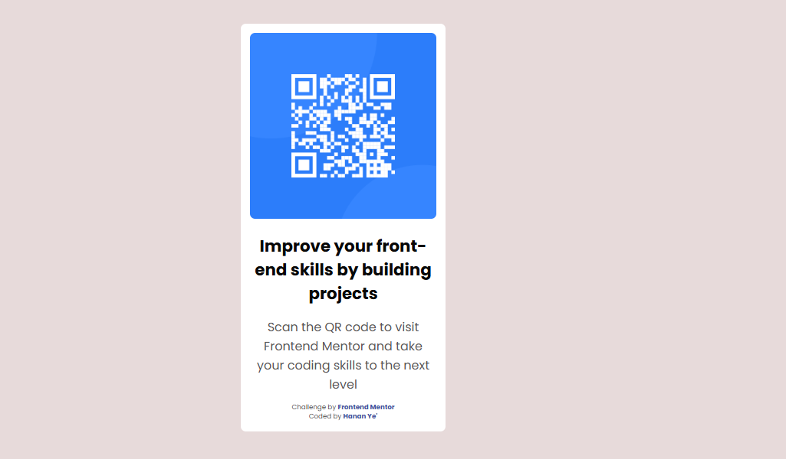

# Frontend Mentor - QR Code Component


## Welcome! 👋

Thanks for checking out this front-end coding challenge.

[Frontend Mentor](https://www.frontendmentor.io) challenges help you improve your coding skills by building realistic projects.

**To do this challenge, you need a basic understanding of HTML and CSS.**

## The Challenge

Your challenge is to build out this QR code component and get it looking as close to the design as possible.

You can use any tools you like to help you complete the challenge. So if you've got something you'd like to practice, feel free to give it a go.

## Screenshot



## Links

- Solution URL: [Add solution URL here](https://github.com/hanan267/QR-Codes)


## My Process

### Built With

- Semantic HTML5 markup
- CSS custom properties
- Flexbox
- Mobile-first workflow

### What I Learned

Use this section to recap over some of your major learnings while working on this project. You can also include code snippets here to show off your new skills.

```html
<h1>Some HTML code I'm proud of</h1># QR-Code
